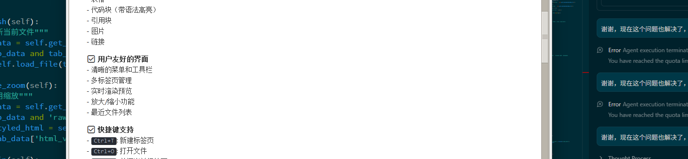

# Markdown 文档查看器

一个简洁实用的 Windows Markdown 文档查看器，使用 Python 和 tkinter 构建。

## 功能特性

✅ **多标签页支持**
- 同时打开多个Markdown文件
- 在不同标签页之间自由切换
- Ctrl+T 新建标签页
- Ctrl+W 关闭当前标签页

✅ **智能链接处理**
- **Markdown文件** (.md, .markdown, .mdown) - 在新标签页中打开
- **文本文件** (.txt, .log, .py, .js等) - 使用Notepad++打开
- **文件夹** - 使用Windows资源管理器打开
- **网络链接** - 使用默认浏览器打开
- 支持相对路径和绝对路径

✅ **完整的 Markdown 支持**
- 标题、段落、列表
- 表格
- 代码块（带语法高亮）
- 引用块
- 图片
- 链接

✅ **用户友好的界面**
- 清晰的菜单和工具栏
- 多标签页管理
- 实时渲染预览
- 放大/缩小功能
- 最近文件列表

✅ **快捷键支持**
- `Ctrl+T`: 新建标签页
- `Ctrl+O`: 打开文件
- `Ctrl+W`: 关闭当前标签页
- `F5`: 刷新
- `Ctrl++`: 放大
- `Ctrl+-`: 缩小
- `Ctrl+0`: 重置缩放

## 安装步骤

### 1. 确保已安装 Python

需要 Python 3.7 或更高版本。检查版本：

```bash
python --version
```

### 2. 安装依赖

在项目目录下运行：

```bash
pip install -r requirements.txt
```

或者手动安装：

```bash
pip install markdown tkhtmlview Pygments
```

## 使用方法

### 方法 1: 直接运行

```bash
python md_viewer.py
```

### 方法 2: 打开指定文件

```bash
python md_viewer.py your_file.md
```

### 方法 3: 创建快捷方式

1. 右键点击 `md_viewer.py`
2. 选择"创建快捷方式"
3. 将快捷方式移动到桌面或开始菜单
4. 可以将 `.md` 文件拖放到快捷方式上打开
5. [启动查看器.bat](./启动查看器.bat)
6. [requirements.txt](./requirements.txt)
7. [md文件](./README.md)
8. [文件夹测试](./test/)


## 打包成可执行文件（可选）

如果想创建独立的 `.exe` 文件，可以使用 PyInstaller：

```bash
# 安装 PyInstaller
pip install pyinstaller

# 打包应用
pyinstaller --onefile --windowed --name="Markdown查看器" md_viewer.py
```

打包完成后，可执行文件位于 `dist` 文件夹中。

## 系统要求

- Windows 7 或更高版本
- Python 3.7+
- 约 50MB 磁盘空间（包括依赖）

## 技术栈

- **GUI 框架**: tkinter (Python 内置)
- **Markdown 解析**: python-markdown
- **HTML 渲染**: tkhtmlview
- **语法高亮**: Pygments

## 截图

应用启动后，您将看到：
- 顶部菜单栏（文件、查看、帮助）
- 工具栏（快速访问常用功能）
- 主显示区域（Markdown 渲染结果）
- 底部状态栏（显示当前文件路径）

## 故障排除

### 问题：导入错误

**解决方案**：确保已安装所有依赖
```bash
pip install -r requirements.txt
```

### 问题：中文显示乱码

**解决方案**：确保 Markdown 文件使用 UTF-8 编码保存

### 问题：图片不显示

**解决方案**：图片路径使用相对路径或绝对路径，确保图片文件存在

## 许可证

本项目仅供学习和个人使用。

## 贡献

欢迎提出建议和改进意见！

---

**享受使用 Markdown 文档查看器！** 📝✨
